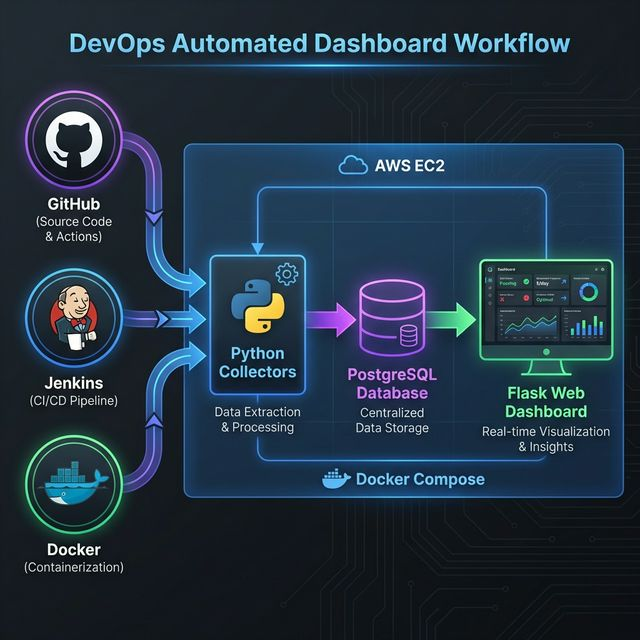

# 🚀 Devops_Automated_Dashboard

A professional-grade DevOps Dashboard from scratch. This guide is optimized for **AWS EC2 (Amazon Linux 2023)**.

---

## ☁️ Phase 1: AWS Infrastructure Setup
Before connecting to your server, configure your AWS Security Group.

### 1. Security Group Configuration
Add these **Inbound Rules** in the AWS Console:
- `22` (SSH): Your IP
- `5001` (Dashboard UI): Anywhere (0.0.0.0/0)
- `8080` (Jenkins UI): Anywhere (0.0.0.0/0)

### 2. Connect to EC2
```bash
ssh -i "your-key.pem" ec2-user@<YOUR_PUBLIC_IP>
```

---

## 📁 Phase 2: Project Installation
On your EC2 instance, clone and prepare the folder.

```bash
# 1. Install Git
sudo dnf install git -y

# 2. Clone the repo
git clone <YOUR_REPO_URL>
cd Devops_Automated_Dashboard

# 3. FIX PERMISSIONS (CRITICAL)
# This ensures you don't get 'Permission Denied' errors later
sudo chown -R ec2-user:ec2-user ~/Devops_Automated_Dashboard
```

---

## � Phase 3: Docker & Infrastructure
If the `docker-compose` command is missing or errors out:

### 1. Install Docker Compose Manually
```bash
sudo curl -L "https://github.com/docker/compose/releases/latest/download/docker-compose-$(uname -s)-$(uname -m)" -o /usr/local/bin/docker-compose
sudo chmod +x /usr/local/bin/docker-compose
```

### 2. Launch Services
```bash
docker-compose up -d
```
*Verify with `docker ps` to see `devops_db` and `devops_jenkins`.*

---

## 🔑 Phase 4: API Keys & Secrets
Create your `.env` file to store your credentials.

### 1. Create the file
```bash
sudo nano .env
```

### 2. Paste your details
```env
DATABASE_URL=postgresql://devops_user:devops_password@db:5432/devops_dashboard
GITHUB_TOKEN=ghp_your_github_token
REPO_OWNER=your_github_username
REPO_NAME=Devops_Automated_Dashboard
JENKINS_URL=http://jenkins:8080
JENKINS_USER=admin
JENKINS_TOKEN=your_jenkins_api_token
```
*Note: To get the Jenkins password, run `docker logs devops_jenkins`.*

---

## � Phase 5: Python Environment & Data Collection
Set up the "Brain" and fetch the initial data.

```bash
# 1. Create Virutal Environment
python3 -m venv venv
source venv/bin/activate

# 2. Install dependencies
pip install --upgrade pip
pip install -r requirements.txt

# 3. RUN COLLECTORS (IMPORTANT!)
# You must run these to see any data on the dashboard
python3 -m scripts.github_collector
python3 -m scripts.jenkins_collector
python3 -m scripts.docker_collector
```

---

## 🌐 Phase 6: Go Live
Launch the dashboard for external access.

### Option A: Standard Run (Terminal must stay open)
```bash
python3 -m app.app
```

### Option B: Background Run (Stays online forever)
```bash
nohup python3 -m app.app > dashboard.log 2>&1 &
```

---

## �️ Troubleshooting Commands
- **Check if running**: `ps aux | grep app.app`
- **View logs**: `tail -f dashboard.log`
- **Stop background app**: `pkill -f app.app`
- **Fix Permission Denied**: `sudo chown -R ec2-user:ec2-user ~/Devops_Automated_Dashboard`
- **Reset Database**: `docker-compose down -v && docker-compose up -d`

---

## 💡 Port Summary
- **5001**: Dashboard Web UI
- **8080**: Jenkins Web UI
- **5432**: PostgreSQL Internal Port
